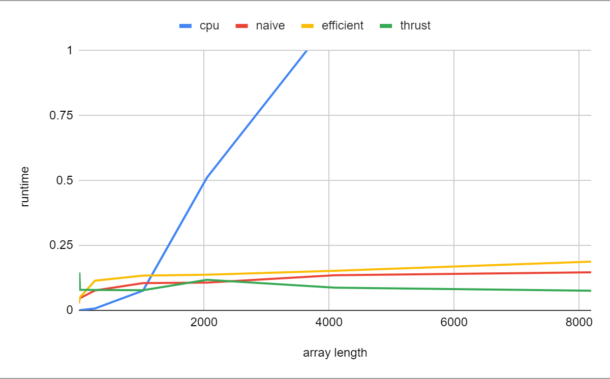

CUDA Stream Compaction
======================

**University of Pennsylvania, CIS 565: GPU Programming and Architecture, Project 2**

* Joshua Nadel
  * https://www.linkedin.com/in/joshua-nadel-379382136/, http://www.joshnadel.com/
* Tested on: Windows 10, i7-6700HQ @ 2.60GHz 16GB, GTX 970M (Personal laptop)

### Scan / Stream Compaction

This project demonstrates the ability of the GPU to quickly complete algorithms that are, in serial, quite slow. It contains both serial and parallel implementations of scan and stream compaction algorithms, and uses timers to compare their performances on large quantities of data.
The list of features includes:
* Serial scan implementation on the CPU
* Serial compact implementation on the CPU
* Naive scan implementation on the GPU
* Work-efficient scan implementation on the GPU
* Work-efficient compact implementation on the GPU
* Wrapper for thrust's scan implementation to compare performance



I do not know how the thrust implementation manages to be so efficient at such large array sizes. In fact, it seems to become increasingly efficient with array length.

It is interesting to note that the efficient implementation is consistently slower than the naive implementation. This is likely due to memory access order.

Predictably, the serial CPU version increases in runtime proportionally to the increase in array size.

The program output reads:
```
****************
** SCAN TESTS **
****************
    [  25  18  37  41  29   8  10  48  21  22  19  18   6 ...  39   0 ]
==== cpu scan, power-of-two ====
   elapsed time: 0.0588ms    (std::chrono Measured)
    [   0  25  43  80 121 150 158 168 216 237 259 278 296 ... 25536 25575 ]
==== cpu scan, non-power-of-two ====
   elapsed time: 0.0569ms    (std::chrono Measured)
    [   0  25  43  80 121 150 158 168 216 237 259 278 296 ... 25478 25497 ]
    passed
==== naive scan, power-of-two ====
   elapsed time: 0.10656ms    (CUDA Measured)
    passed
==== naive scan, non-power-of-two ====
   elapsed time: 0.105216ms    (CUDA Measured)
    passed
==== work-efficient scan, power-of-two ====
   elapsed time: 0.116672ms    (CUDA Measured)
    passed
==== work-efficient scan, non-power-of-two ====
   elapsed time: 0.13984ms    (CUDA Measured)
    passed
==== thrust scan, power-of-two ====
   elapsed time: 0.119264ms    (CUDA Measured)
    passed
==== thrust scan, non-power-of-two ====
   elapsed time: 0.071648ms    (CUDA Measured)
    passed

*****************************
** STREAM COMPACTION TESTS **
*****************************
    [   2   2   1   0   2   1   1   0   1   0   1   0   1 ...   1   0 ]
==== cpu compact without scan, power-of-two ====
   elapsed time: 0.0038ms    (std::chrono Measured)
    [   2   2   1   2   1   1   1   1   1   3   2   1   2 ...   2   1 ]
    passed
==== cpu compact without scan, non-power-of-two ====
   elapsed time: 0.0032ms    (std::chrono Measured)
    [   2   2   1   2   1   1   1   1   1   3   2   1   2 ...   1   1 ]
    passed
==== cpu compact with scan ====
   elapsed time: 0.069ms    (std::chrono Measured)
    [   2   2   1   2   1   1   1   1   1   3   2   1   2 ...   2   1 ]
    passed
==== work-efficient compact, power-of-two ====
   elapsed time: 0.199904ms    (CUDA Measured)
    passed
==== work-efficient compact, non-power-of-two ====
   elapsed time: 0.1856ms    (CUDA Measured)
    passed
Press any key to continue . . .```